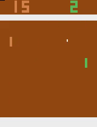
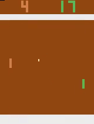
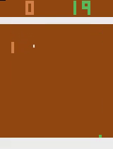
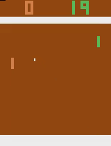

# Machine Learning Nano Degree Capstone Project: Deep Reinforcement Learning to train an agent to play Atari Pong game using DQN


  |   |   |  
:-------------------------:|:-------------------------:|:-------------------------:|:-------------------------:
Random model  |  DQN 5260000 steps |  DQN 8090000 steps | DQN 9500000 steps

I have obtained the starter code from CS 294: Deep Reinforcement Learning, Spring 2017

https://github.com/berkeleydeeprlcourse/homework/tree/master/sp17_hw/hw3

Make sure to install Tensorflow, OpenAI Gym, numpy, pandas and bokeh before running these scripts.

Run the training using the following command

```python run_dqn_atari.py >> train_logs_new.log```


There is a jupyter notebook, named ```DQN report.ipynb```, which has all the code for plotting the stats presented in the report. The file named ```DQN_report.html``` is the html snapshot of the jupyter notebook. The file named ```record.pdf``` has the complete report of the project.
